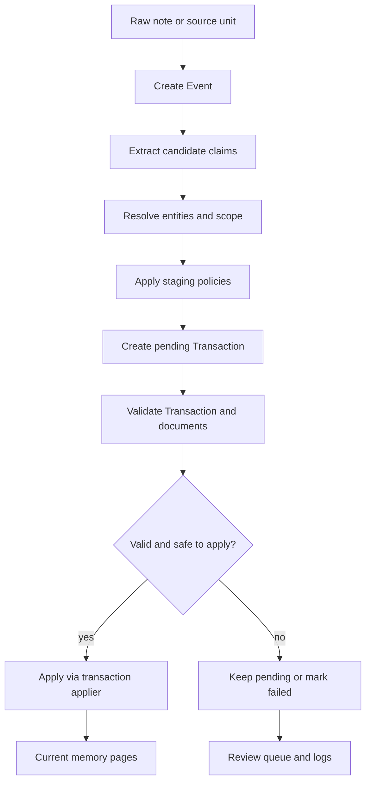
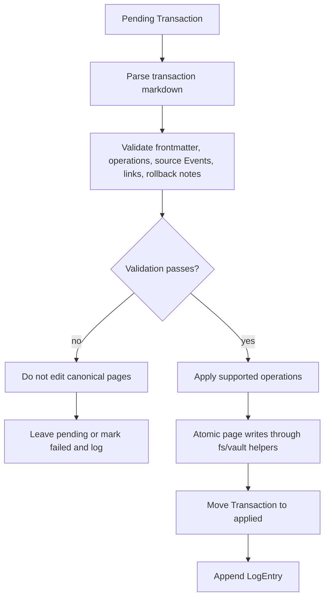
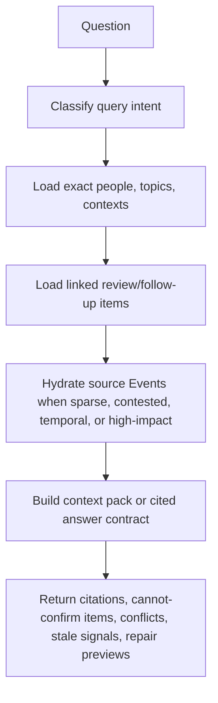
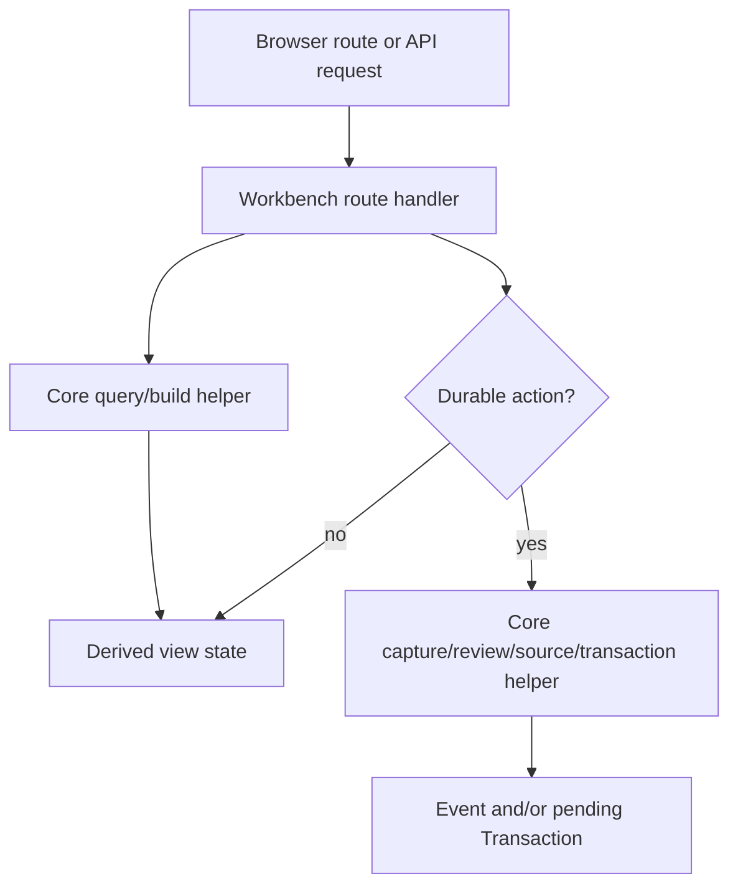
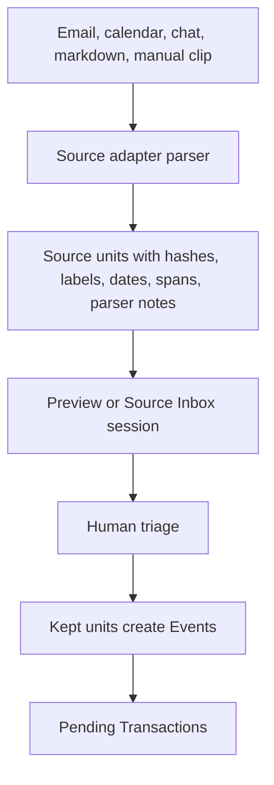
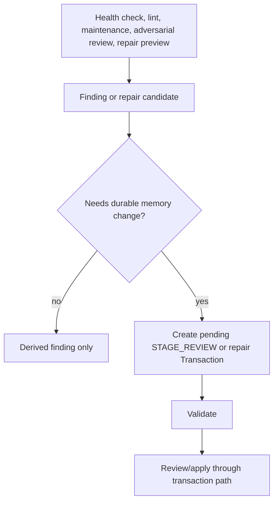
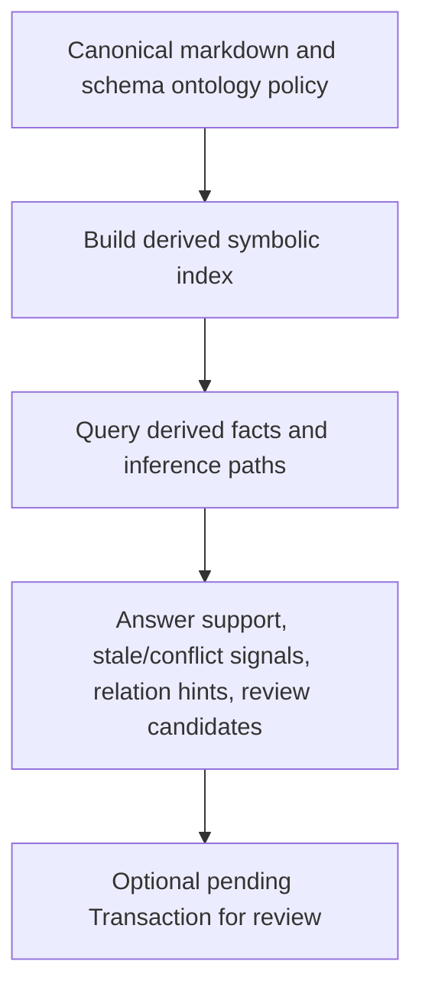

# Project Architecture

This guide is the first-stop map for Assisto internals. It is intentionally a
synthesis layer: it helps humans and LLM agents understand the implemented
system without replacing the deeper sources of truth.

Authoritative sources remain:

- `AGENTS.md` for agent rules, invariants, and write boundaries.
- `docs/revised-design.md` for the canonical architecture and schema design.
- `docs/decisions.md` for accepted architecture decisions.
- `docs/implementation-plan.md` for current status, roadmap, and validation by
  changed area.
- `memory/schema/**` for memory schema and policy files.

## System Overview

Assisto is a local-first markdown work-memory assistant. Markdown under
`memory/` is the durable source of record. Everything else exists to capture,
validate, review, retrieve, explain, or operate on that memory safely.

The safe compiler core is:

```text
Raw input -> Event -> Candidate claims -> Transaction -> Validated mutation or staged review -> Current pages
```

The key rule for refactoring is simple: durable memory is created only through
Events, Transactions, validation, and review. Generated text, retrieval output,
Workbench state, context packs, symbolic reasoning output, briefs, indexes, and
session files may guide or propose changes, but they do not directly rewrite
canonical memory.

## Canonical And Derived State

| Layer | Examples | Role | Canonical? |
|---|---|---|---|
| Raw evidence | source text, imported notes, clips | Input material before normalization | No |
| Events | `memory/events/**` | Preserved evidence and extraction candidates | Yes |
| Transactions | `memory/transactions/**` | Reviewable mutation proposals and apply logs | Yes |
| Current memory pages | people, contexts, topics, followups, review, logs | Current durable work memory | Yes |
| Schema and policy | `memory/schema/**` | Object, status, relation, ontology policy | Yes |
| Derived views | Workbench, briefs, health summaries, context packs | Operational surfaces and summaries | No |
| Derived indexes | `memory/indexes/**`, symbolic JSONL, retrieval caches | Rebuildable search/reasoning support | No |
| Local session state | `.assisto-local/**` | UI/session/dogfood state | No |

Inference laundering is a P1 bug: generated, inferred, weakly supported, or
retrieval-assembled text must not become durable truth without Event evidence
and a validated Transaction.

## Repository Topology

| Path | Owns | Notes |
|---|---|---|
| `packages/core/src/model` | Core object, claim, operation, status, and ID types | Keep semantic enums here; avoid parallel status names. |
| `packages/core/src/markdown` | Markdown parsing helpers | Used by validators, readers, and Workbench displays. |
| `packages/core/src/fs` and `packages/core/src/vault` | Vault-safe path resolution, reads, atomic writes, file listing | These enforce filesystem boundaries; do not bypass them for canonical writes. |
| `packages/core/src/validators` | Frontmatter, claim, source-event, wikilink, ID, follow-up, scope, summary, ambiguous-entity, and rollback checks | Validation must fail before canonical page edits. |
| `packages/core/src/transactions` | Transaction parsing, serialization, validation, apply/reject/fail paths, ingest logs | Multi-file durable changes flow here. |
| `packages/core/src/policies` | Deterministic follow-up, entity, and staging policy helpers | Prefer deterministic rules over model-dependent behavior. |
| `packages/core/src/ingest` and `packages/core/src/extraction` | Candidate extraction, event creation, entity resolution, transaction draft building, event reprocessing | Ingestion may create Events and pending Transactions; it must not directly write current pages. |
| `packages/core/src/capture`, `import`, `source-adapters`, `source-inbox`, `sources`, `workday-capture` | Capture/import/source normalization workflows | Source adapters preserve raw source details and route kept units into Events/Transactions. |
| `packages/core/src/review`, `entities`, `contexts` | Review queues, entity stewardship, context dashboards, context operating rooms, repair transactions | Stewardship surfaces are derived or transaction-backed, not autonomous merge tools. |
| `packages/core/src/retrieval`, `answers`, `context-packs` | Lexical retrieval, context packing, cited answer contracts, repair previews | Answers are derived contracts; they may not persist generated truth. |
| `packages/core/src/ontology`, `frames`, `symbolic` | Derived ontology policy, frame validation, symbolic index build/query | Ontology policy lives under schema; symbolic outputs are rebuildable and proof-backed. |
| `packages/core/src/health`, `maintenance`, `lint` | Deterministic health/lint/maintenance checks and review staging | Findings can stage review through Transactions; they do not directly write ReviewItems. |
| `packages/core/src/today`, `daily`, `activation`, `use-tomorrow`, `workday-modes`, `briefs`, `dogfood`, `dogfood-eval`, `friction`, `capture-feedback`, `seed` | Daily operation, activation, briefs, feedback, dogfood loops | Operational outputs are derived unless they explicitly create Events/Transactions. |
| `packages/cli` | `wm` command wrappers over core APIs | Keep command parsing and presentation here; deterministic semantics belong in core. |
| `packages/workbench` | Local HTTP Workbench UI/API | Workbench views are derived; durable UI actions route through core transaction/capture helpers. |
| `packages/pi-extension` | Pi integration tools, commands, and write guard | Pi writes must respect the same canonical/derived boundaries. |
| `scripts` | Repo automation, validation, agent helpers, Mixedbread upload/smoke scripts | Do not encode new canonical memory semantics here. |
| `tests` and `tests/browser` | Unit, integration, scenario, and browser coverage | Use tests to locate expected behavior before refactors. |
| `tests/scenarios` and `tests/golden` | Eval scenario runners and thresholds | Use when behavior touches retrieval, answers, dogfood, or staged architecture tracks. |
| `memory/schema` | Human-readable schema, status, validator, relation, frame, and ontology policy | Schema/policy is canonical; indexes built from it are not. |

## Package Boundaries

`@assisto/core` owns deterministic semantics. It exports the public library
surface from `packages/core/src/index.ts`, including model, markdown,
validators, fs/vault, transactions, policies, ingest/extraction, capture,
review, retrieval/answers, health, maintenance, source adapters, entity/context
surfaces, ontology, frames, and symbolic helpers.

`@assisto/cli` owns command-line UX. It imports core APIs, parses command
arguments, formats output, and starts Workbench when requested. If a behavior is
shared with Workbench or Pi, implement it in core and call it from the wrapper.

`@assisto/workbench` owns the local browser surface and HTTP routes. It imports
core APIs, builds derived snapshots, and routes write actions through capture,
review, source-inbox, maintenance, and transaction helpers. Workbench state is
not canonical memory.

`@assisto/pi-extension` owns Pi-specific tools, slash commands, and write guard
integration. It exposes memory operations through the same core APIs and blocks
unsafe direct writes to canonical pages.

## Workflow Data Flows

### Ingestion And Capture



Implementation anchors:

- `packages/core/src/capture`
- `packages/core/src/ingest`
- `packages/core/src/extraction`
- `packages/core/src/policies`
- `packages/core/src/transactions`

### Transaction Application



Only supported MVP operations are `ADD_EVENT`, `UPSERT_CLAIM`, `STAGE_REVIEW`,
`NOOP`, `SUPERSEDE_CLAIM`, and `CLOSE_FOLLOWUP`. Deferred operations such as
`MERGE`, `SPLIT`, `DELETE`, and `AUTO_RESOLVE_CONTRADICTION` must remain
staging/detection only.

### Retrieval And Answers



Retrieval and answers are derived. They may expose repair actions, but durable
repair writes still need Events and/or pending Transactions.

Implementation anchors:

- `packages/core/src/retrieval`
- `packages/core/src/answers`
- `packages/core/src/context-packs`
- `docs/cited-work-memory.md`

### Workbench



Workbench must not invent an alternate memory model. It is an operating surface
over core APIs.

Implementation anchors:

- `packages/workbench/src/index.ts`
- `docs/workbench.md`
- `tests/workbench.mjs`
- `tests/browser/workbench-*.spec.mjs`

### Source Adapters And Source Inbox



Adapters normalize source material. They do not write Person, Context, Topic,
FollowUp, or ReviewItem pages directly.

Implementation anchors:

- `packages/core/src/source-adapters`
- `packages/core/src/source-inbox`
- `packages/core/src/import`
- `docs/source-adapters.md`

### Repair, Health, And Maintenance



Maintenance domain events are not source Events. Repair and adversarial review
must remain transaction-backed.

Implementation anchors:

- `packages/core/src/health`
- `packages/core/src/maintenance`
- `packages/core/src/lint`
- `packages/core/src/entities/repair-actions-v2.ts`
- `docs/repair-actions.md`

### Ontology And Symbolic Reasoning



Ontology policy belongs under `memory/schema/ontology/`. Symbolic JSONL and
reasoning outputs belong under derived indexes. They must not outrank cited
claims or source Events, and they cannot directly create active claims.

Implementation anchors:

- `packages/core/src/ontology`
- `packages/core/src/frames`
- `packages/core/src/symbolic`
- `memory/schema/ontology/**`
- `docs/ontology-and-symbolic-reasoning.md`

## Current Implementation Status

Status is summarized here for orientation. `docs/implementation-plan.md` owns
the active roadmap and validation matrix.

| Track | Implemented shape |
|---|---|
| MVP | Transaction-safe core, schemas, validators, deterministic staging. |
| v2 | Candidate extraction pipeline and provider-ready LLM candidate output. |
| v3 | Deterministic hardening, org-chart detectors, safe upserts, Event reprocessing. |
| retrieval | Deterministic query intent and lexical answer basis. |
| v4 | Local Workbench foundation, review, transactions, health, briefs, browser coverage. |
| v5 | Capture, import, Today, entity/context surfaces, dogfood flows, optional provider. |
| v6 | Activated daily loop, answer drafts, friction logging, import triage, context pages. |
| v7 | First-day activation OS, personal dogfood eval, workday modes. |
| v8 | Ask -> Entity -> Context cited work-memory loop, answer contracts, entity risk, Context operating rooms/timelines. |

Known post-v8 tracks include boundary hardening, cited answer hardening, entity
stewardship hardening, Context operating room hardening, source adapter fabric,
derived ontology registry, symbolic reasoning/proof traces, and consolidation
or maintenance cycles.

## Refactoring Map

| Area | Owns | Key files | Common callers | Tests/evals | Invariants |
|---|---|---|---|---|---|
| Model and enums | Object, claim, operation, ID, and status contracts | `packages/core/src/model/**` | All core modules | `tests/core-model-enums.mjs` | Do not add generic `status`, `classification`, or `confidence` fields for MVP objects. |
| Markdown, fs, vault | Safe file reading/writing and markdown parsing | `packages/core/src/markdown`, `packages/core/src/fs`, `packages/core/src/vault` | Validators, transactions, Workbench, CLI | `tests/core-markdown.mjs`, `tests/core-fs-vault.mjs` | Canonical writes stay inside `memory/` and use safe helpers. |
| Validators | Schema, provenance, links, IDs, follow-up trigger, scope, summary, ambiguity, rollback checks | `packages/core/src/validators/index.ts` | CLI validate, transaction apply, scripts | `tests/core-validators.mjs`, `tests/check-memory-data.mjs` | Validation failure prevents canonical page edits. |
| Transactions | Transaction parsing, validation, apply/reject/fail, logs | `packages/core/src/transactions/index.ts` | CLI `tx`, Workbench transaction/review routes, ingestion | `tests/core-transactions.mjs`, `tests/core-transaction-apply.mjs` | Multi-file mutations route through Transactions only. |
| Policies | Follow-up intent, entity resolution, staging reasons | `packages/core/src/policies/index.ts` | Ingest, extraction, review, tests | `tests/core-policies.mjs` | Explicit trigger phrases are required for committed FollowUps; near/ambiguous entities stage review. |
| Ingestion and extraction | Event creation, candidates, transaction drafts, Event reprocessing, optional provider output | `packages/core/src/ingest/**`, `packages/core/src/extraction/index.ts` | CLI ingest/capture, Pi, Workbench capture/import | `tests/core-ingest.mjs`, `tests/core-ingest-pipeline.mjs`, `tests/core-extraction.mjs`, `tests/scenarios/run-mvp.mjs` | Ingestion creates Events and pending Transactions, never direct current-page writes. |
| Capture/import/source | Capture notes, source adapters, Source Inbox, import triage | `packages/core/src/capture`, `import`, `source-adapters`, `source-inbox`, `sources` | CLI, Workbench, Pi | `tests/core-capture.mjs`, `tests/core-import.mjs`, `tests/core-source-adapters.mjs`, `tests/core-source-inbox.mjs`, `tests/scenarios/run-source-adapters.mjs` | Source units preserve raw source details and route kept units through normal Event/Transaction flow. |
| Retrieval and answers | Context packing, cited answer contracts, repair previews | `packages/core/src/retrieval`, `answers`, `context-packs` | CLI ask, Workbench Ask, Pi ask | `tests/core-retrieval.mjs`, `tests/core-answer-contract-v3.mjs`, `tests/core-answer-contract-v4.mjs`, `tests/core-context-packs.mjs`, `tests/scenarios/run-retrieval.mjs`, `tests/scenarios/run-answers.mjs`, `tests/scenarios/run-v8.mjs` | Retrieval output is derived and citation-first; repair writes still route through Events/Transactions. |
| Review/entity/context | Review queues, review transactions, entity stewardship, context dashboards/rooms/timelines | `packages/core/src/review`, `entities`, `contexts` | CLI review/entities/context, Workbench review/entities/context | `tests/core-entities.mjs`, `tests/entity-stewardship-v2.mjs`, `tests/context-operating-room-v3.mjs`, `tests/entity-repair-actions-v2.mjs` | No autonomous people/topic merges, splits, deletes, or contradiction resolution. |
| Health/maintenance/lint | Deterministic checks, maintenance plans/runs, staged findings | `packages/core/src/health`, `maintenance`, `lint` | CLI health/maintenance/lint, Workbench Health | `tests/core-health.mjs`, `tests/core-maintenance.mjs`, `tests/core-lint.mjs`, `tests/scenarios/run-maintenance.mjs` | Findings may stage review; they do not create canonical ReviewItems directly. |
| Workbench | Local HTTP API and browser UI state | `packages/workbench/src/index.ts` | CLI `workbench serve`, e2e/browser tests | `tests/workbench.mjs`, `tests/run-e2e.mjs`, `tests/browser/workbench-*.spec.mjs`, `tests/scenarios/run-v4.mjs` through `run-v10.mjs` | Workbench state is derived; durable actions call core helpers. |
| CLI | Command parsing and terminal UX | `packages/cli/src/index.ts`, `packages/cli/bin/wm.mjs` | User commands, integration tests | `tests/cli-integration.mjs` | Shared behavior belongs in core, not command wrappers. |
| Pi extension | Pi tool/command registration and write guard | `packages/pi-extension/src/index.ts` | Pi runtime | `tests/pi-extension.mjs` | Direct writes to canonical current pages are blocked unless routed through safe tools. |
| Ontology/frames/symbolic | Schema ontology policy, typed frames, derived symbolic index and queries | `packages/core/src/ontology`, `frames`, `symbolic`, `memory/schema/ontology/**` | CLI reason/indexes, Workbench symbolic routes | `tests/core-ontology.mjs`, `tests/core-ontology-aware-frames.mjs`, `tests/core-frame-extraction.mjs`, `tests/core-frames.mjs`, `tests/symbolic-index-builder.mjs`, `tests/symbolic-query.mjs` | Symbolic outputs are derived-only and inference-path-backed. |
| Daily/dogfood/briefs | Activation, Today, daily queues, modes, briefs, feedback loops | `packages/core/src/today`, `daily`, `activation`, `use-tomorrow`, `workday-modes`, `briefs`, `dogfood`, `dogfood-eval` | CLI, Workbench, scenario evals | `tests/core-today.mjs`, `tests/core-daily.mjs`, `tests/core-activation.mjs`, `tests/core-use-tomorrow.mjs`, `tests/core-workday-modes.mjs`, `tests/core-briefs.mjs`, `tests/core-dogfood*.mjs`, `tests/scenarios/run-dogfood-local.mjs` | Briefs and operating-loop outputs are disposable unless explicitly captured through Events/Transactions. |
| Scripts/agent tooling | Repo validation, agent runs, CI parity, policy validation, Mixedbread upload/smoke | `scripts/*.mjs`, `scripts/*.sh` | package scripts, Codex workflows | `tests/agent-*.mjs`, `tests/script-helpers.mjs` | Automation must not become an alternate canonical writer. |

## Refactoring Rules For LLM Agents

1. Read `AGENTS.md`, this guide, `docs/revised-design.md`,
   `docs/implementation-plan.md`, and `docs/decisions.md` before cross-cutting
   edits.
2. Inspect `git status --short --branch` before changing files. Preserve
   unrelated local changes and treat `memory/events/**`,
   `memory/transactions/**`, and `.assisto-local/**` as user data unless the
   user explicitly says otherwise.
3. Use Mixedbread retrieval as a wayfinder before non-trivial edits, then open
   the local files before patching. Local files win over stale search snippets.
4. Put deterministic semantics in `packages/core`. Keep `packages/cli`,
   `packages/workbench`, and `packages/pi-extension` as wrappers or integration
   surfaces around core behavior.
5. Do not add vector search, graph database, MCP, symbolic reasoning, briefs,
   Workbench state, or semantic indexes as canonical memory.
6. Do not create standalone canonical Decision, OpenQuestion, or Explanation
   pages in the MVP. Use existing sections, derived output, or staged review.
7. Do not implement autonomous entity merges, contradiction resolution, splits,
   deletes, or generated answer persistence. Implement detection/staging only.
8. If a change touches durable memory semantics, add or update tests close to
   the owning core area and run the validation matrix below.

## Validation Matrix

Use this as the default validation plan. Broaden it when the changed area has a
larger blast radius.

| Changed area | Commands |
|---|---|
| Docs only | `pnpm lint`, `pnpm typecheck`, `pnpm test`, `pnpm check:memory-data` |
| Core/schema/transactions | `pnpm validate:local` |
| Ingestion, validation, transactions, follow-ups, retrieval, entity resolution, linting, or evals | `pnpm validate:local` plus relevant evals |
| Retrieval/answers/context packs | `pnpm eval:retrieval`, `pnpm eval:answers`, `pnpm eval:v8` |
| Source adapters | `pnpm eval:source-adapters` |
| Workbench/browser | `pnpm test:e2e`, `pnpm test:browser`, relevant scenario eval |
| Full CI parity | `pnpm validate:ci-parity` |

Before staging or committing, run:

```bash
pnpm check:memory-data
```

## Human Reading Path

Start here when you want a single mental model:

1. Read this file for the system map, package boundaries, and status snapshot.
2. Read `README.md` for setup, quickstart, and command examples.
3. Read `docs/revised-design.md` when you need the detailed architecture and
   schema specification.
4. Read `docs/decisions.md` when you need to understand why a boundary exists.
5. Read `docs/implementation-plan.md` for roadmap and validation expectations.
6. Read focused docs for specific surfaces:
   - `docs/workbench.md`
   - `docs/cited-work-memory.md`
   - `docs/source-adapters.md`
   - `docs/repair-actions.md`
   - `docs/ontology-and-symbolic-reasoning.md`
   - `docs/evidence-to-reasoning-work-memory.md`

## Glossary

| Term | Meaning |
|---|---|
| Event | Canonical evidence page preserving raw input and extraction candidates. |
| Claim | Structured fact, inference, assumption, preference, or commitment embedded in a canonical page. |
| Transaction | Canonical mutation proposal and apply record for durable changes. |
| ReviewItem | Canonical page for staged, contested, duplicate, stale, or unscoped memory issues. |
| Current page | Person, Context, Topic, FollowUp, ReviewItem, or Log page representing durable memory state. |
| Derived output | Rebuildable or disposable view, answer, pack, brief, index, symbolic result, or UI/session state. |
| Inference laundering | A generated or weakly supported statement becoming durable truth without Event evidence and a validated Transaction. |
| Source adapter | Parser/normalizer that turns external material into source units, previews, Source Inbox sessions, Events, and pending Transactions. |
| Context operating room | Derived cockpit for context/project/system/team state, risks, questions, follow-ups, and source timeline. |
| Repair action | Preview or transaction-backed path for fixing missing memory, retrieval misses, entity issues, scope issues, role/reporting issues, or health findings. |

## Drift Checks For This Guide

When updating this guide, verify:

- It does not declare any new canonical object type.
- It keeps vector, graph, semantic, symbolic, MCP, Workbench, pack, brief, and
  eval-session artifacts derived unless routed through Events and Transactions.
- It does not imply autonomous entity merge, contradiction resolution, split,
  delete, or generated-answer persistence.
- Its status snapshot agrees with `docs/implementation-plan.md`.
- Its policy claims agree with `AGENTS.md`, `docs/revised-design.md`, and
  `docs/decisions.md`.
